

# Robotics For Developers

---

An Introduction to Robotics and ROS - for software people!

---

# Presentation Goals

- Review Robotics Development
- Introduce the Robotics Operating System (ROS)
- Get Developers excited to write Robot Code!

---

# Who am I?

<!--v-->

# Gabriel Isko
- Robotics Engineer
- Applications at RoboteQ
- Obsessed with Robots

---

# What is a Robot?

<!--v-->

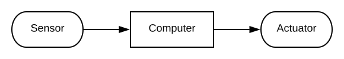

<!--v-->

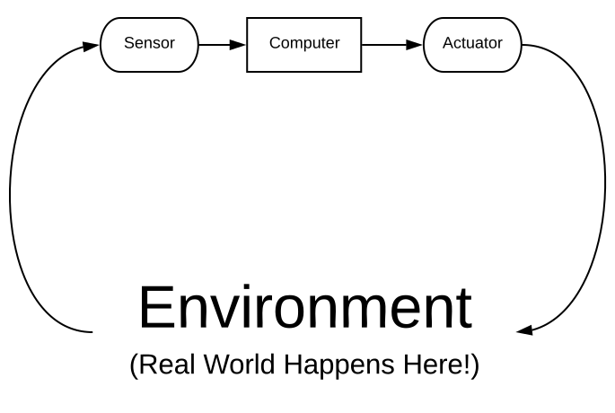

<!--v-->

<!--v-->

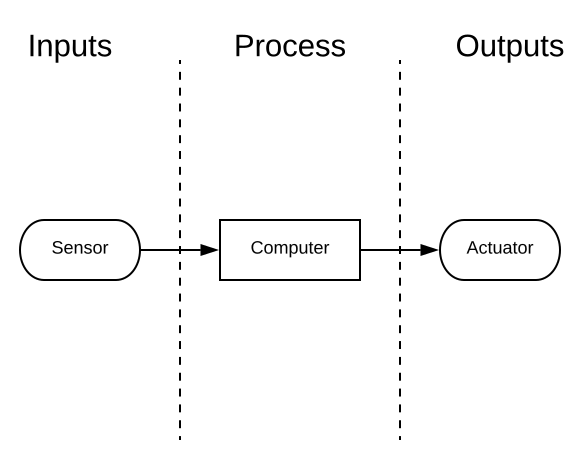

<!--v-->

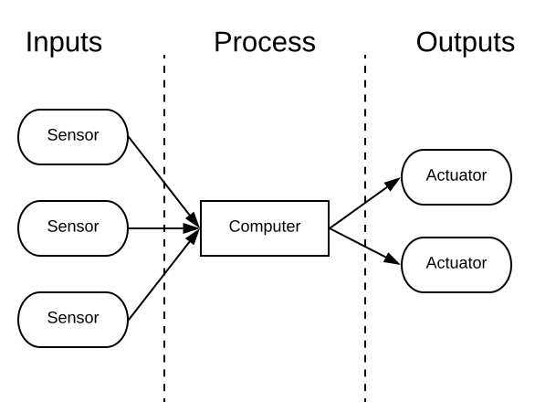

<!--v-->

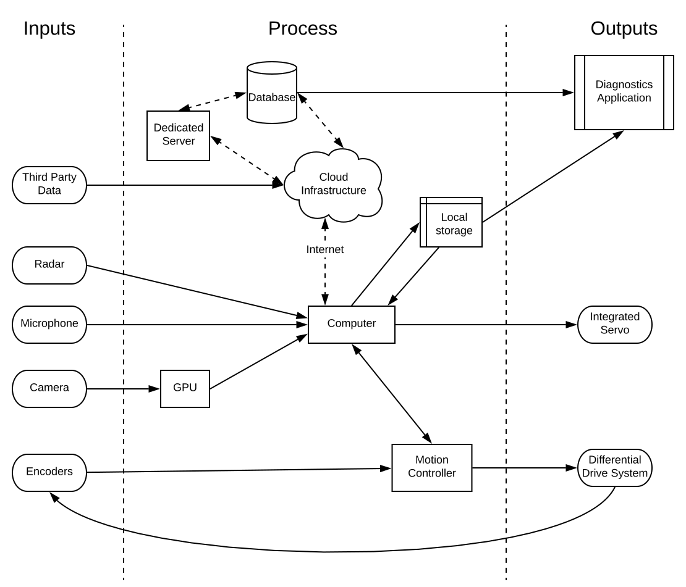

<!--v-->

## It's Getting Complicated!

---

# How do we write software for these Robots?

---

## Hobbyist Method: Write some code!

<!--v-->

Works well enough for simple Robots

Remember this guy?

<!--v-->

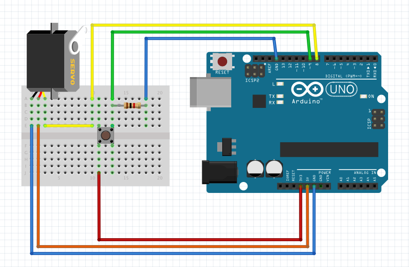

<!--v-->

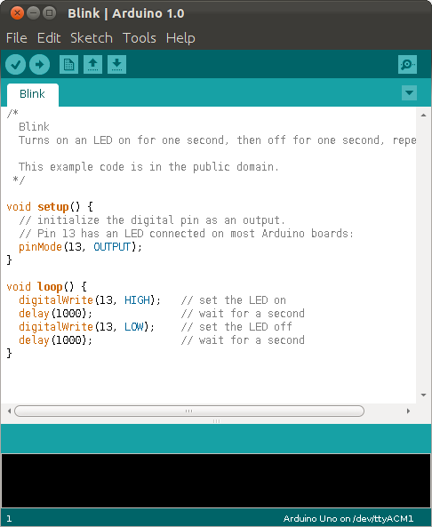

<!--v-->

## Pros:

- Easy to set up
- Simple to use
- Great for Hobbyiests and Educators

<!--v-->

## Cons:
- One source code file
- Not maintainable, extensible or scalable
- Breaks whenever we try to do something complicated

---

## Industrial Method: Kludge Automation Technology!

<!--v-->

Programmable Logic Controllers:

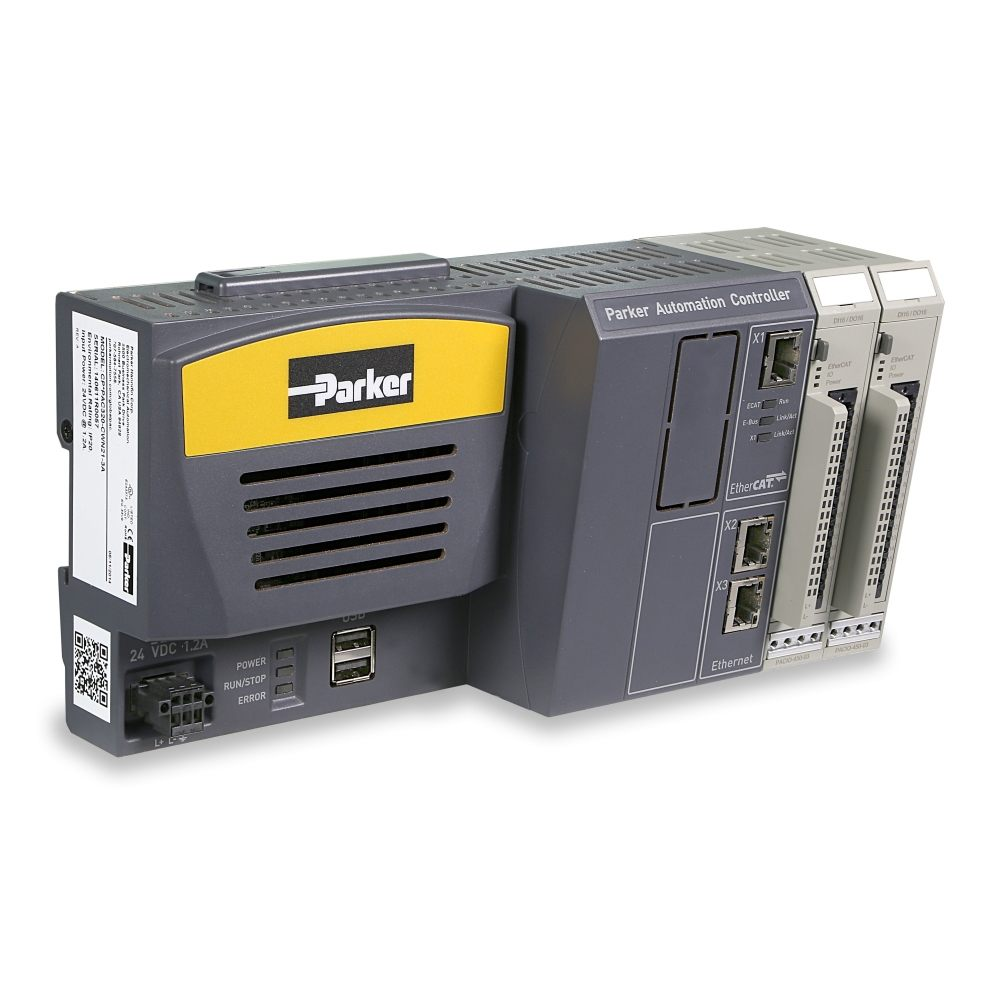

<!--v-->

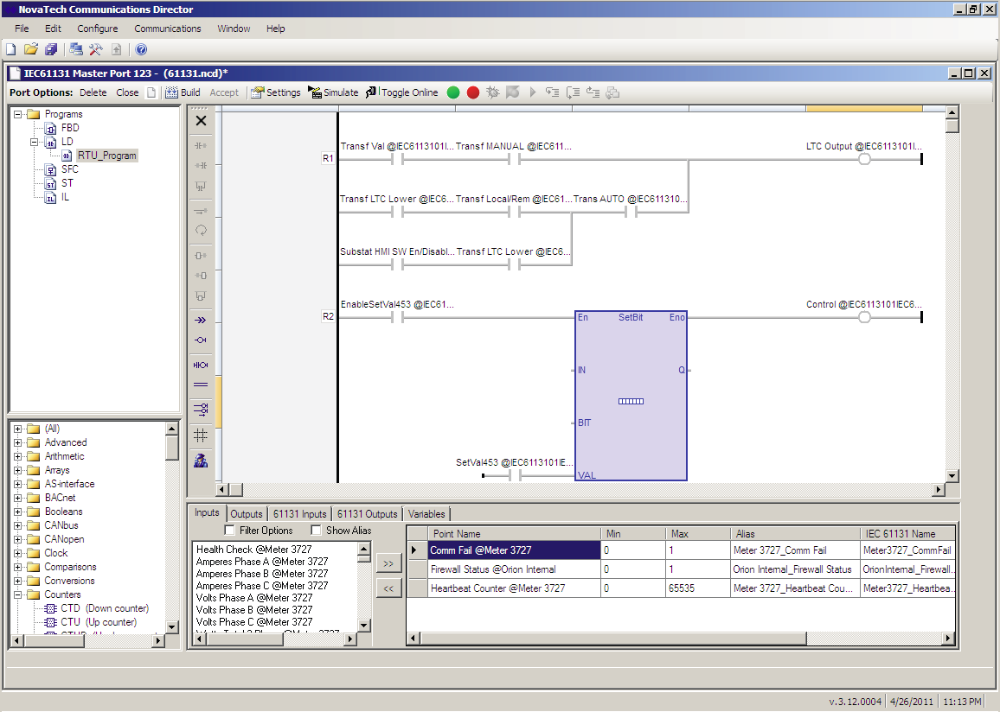

<!--v-->

Communication Methods:

|                                                      |                                                      |
| ---------------------------------------------------- | ---------------------------------------------------- |
| 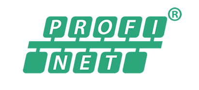 |   |
| 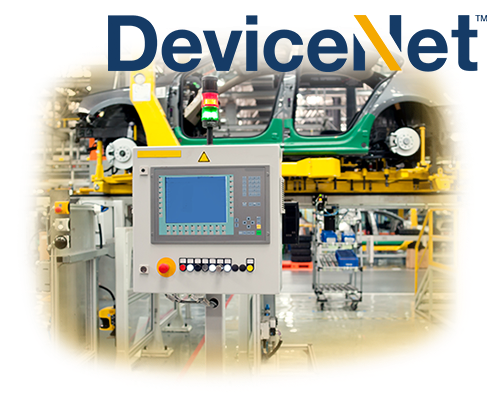  | 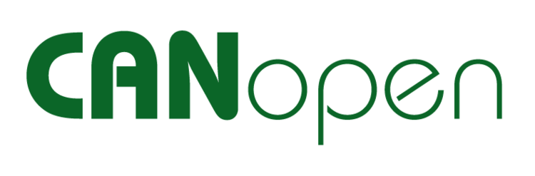 |

<!--v-->

## Pros:

- Used for other Applications
- Actively support by Companies
- Provides the Backbone of automation

<!--v-->

## Cons:

- Full of proprietary systems that don't work well together
- Controller by Corporations that have conflicting business interests
- Ultimately, not suitable for Robotics

---

# IS THERE NO GOOD WAY?

---

(let's back up)

---

# How do we develop Modern Software?

<!--v-->

# Pick a programming Language

| 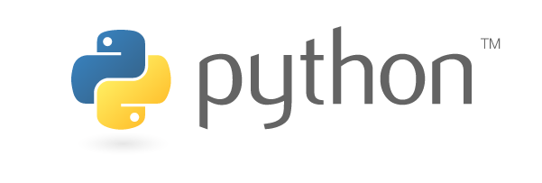 | 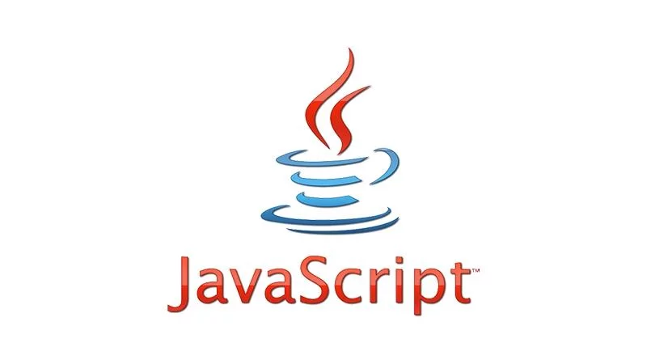 | 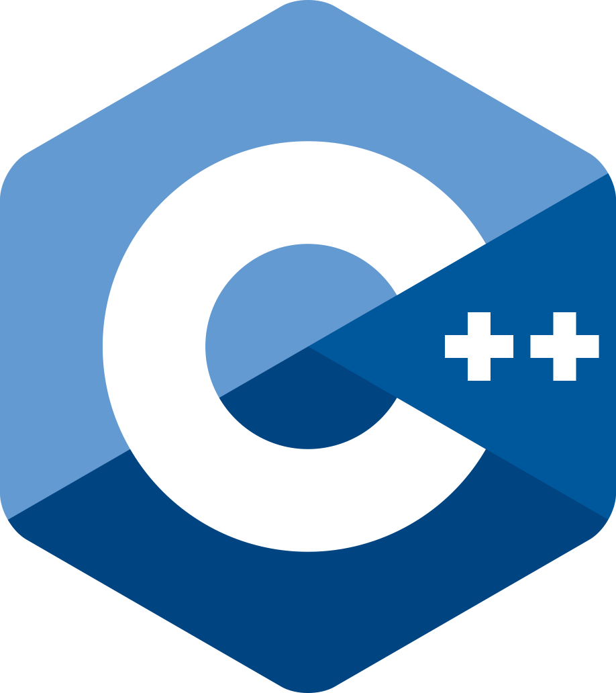 |
| --------------------------------------------------------------- | ------------------------------------------------------------------- | ------------------------------------------------------------ |
|                                                                 |                                                                     |                                                              |
