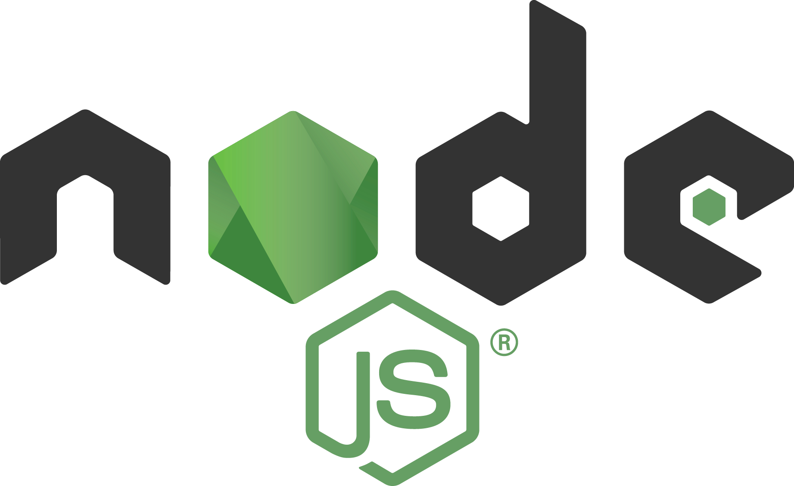
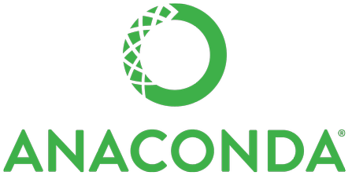
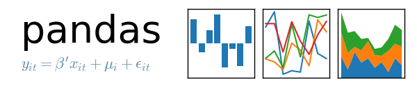
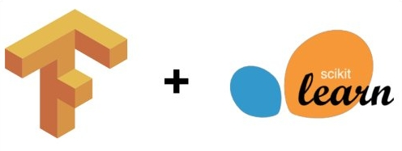
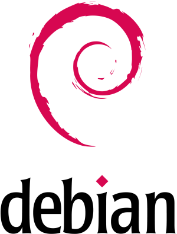
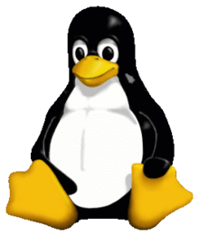
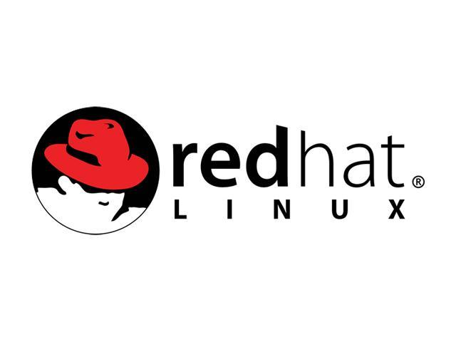

# Robotics For Developers

---

An Introduction to Robotics and ROS - for software people!

---

# Presentation Goals

- Review Robotics Development
- Introduce the Robotics Operating System (ROS)
- Get Developers excited to write Robot Code!

---

# Who am I?

<!--v-->

# Gabriel Isko
- Robotics Engineer
- Applications at RoboteQ
- Obsessed with Robots

---

# What is a Robot?

<!--v-->

<!--v-->

<!--v-->

<!--v-->

<!--v-->

<!--v-->

<!--v-->

## It's Getting Complicated!

---

# How do we write software for these Robots?

---

## Hobbyist Method: Write some code!

<!--v-->

Works well enough for simple Robots

Remember this guy?

<!--v-->

<!--v-->

<!--v-->

## Pros:

- Easy to set up
- Simple to use
- Great for Hobbyiests and Educators

<!--v-->

## Cons:
- One source code file
- Not maintainable, extensible or scalable
- Breaks whenever we try to do something complicated

---

## Industrial Method: Kludge Automation Technology!

<!--v-->

Programmable Logic Controllers:

<!--v-->

<!--v-->

Communication Methods:

|                                                      |                                                      |
| ---------------------------------------------------- | ---------------------------------------------------- |
|  |   |
|   |  |

<!--v-->

## Pros:

- Used for other Applications
- Actively support by Companies
- Provides the Backbone of automation

<!--v-->

## Cons:

- Full of proprietary systems that don't work well together
- Controller by Corporations that have conflicting business interests
- Ultimately, not suitable for Robotics

---

# IS THERE NO GOOD WAY?

---

(let's back up)

---

# How do we Develop Modern Software?

<!--v-->

## Pick a programming Language

|  |  |  |
| --------------------------------------------------------------- | ------------------------------------------------------------------- | ------------------------------------------------------------ |

<!--v-->

## What this accomplishes

- Different programming languages are suitable for different applications
- We can choose the lanuage most appropriate for our project
-

<!--v-->

## Not Enough for Modern Software Development
- Doesn't help us re-use software libraries that aren't Standard
- Doesn't help us build, test, or distribute the software we develop
- Doesn't (always) Help us port code to multitple platforms
- Maybe we want to use more than one language...
<!--v-->

## Pick a Software Ecosystem
- Package manager
- Package Repositories, Standard Universes
- Standardized Development Tools and libraries

<!--v-->

# Examples

<!--v-->

# How do I Build a Website?

<!--v-->

## I could use Node JS, and the NPM package Manger

<!--v-->

# I want to make a Data Science Application

<!--v-->

# I can use the Anaconda Distributtion of Python

<!--v-->

# Let's go Broader

<!--v-->

# I want to Develop Software and administarte a Computer

<!--v-->

# I can Use A GNU/Linux Distribution, and Associated Tools

